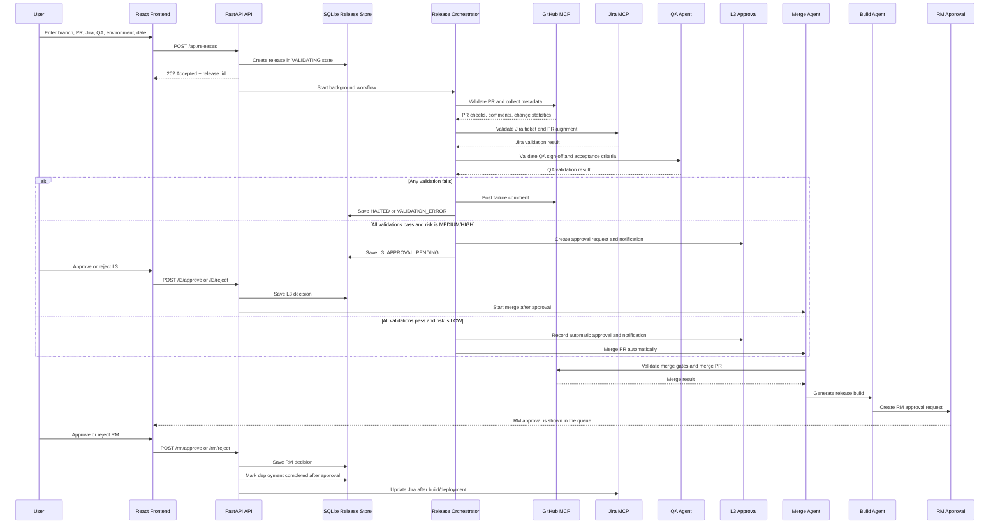

# Release Automation Workflow

This document describes the end-to-end workflow implemented by the release automation application.

## 1. Application Shape

The application has two parts:

- **Frontend:** React and TypeScript application in `frontend/`.
- **Backend:** FastAPI application in `backend/`.

The backend owns the release state and workflow. The frontend submits releases, displays the current state, polls while work is running, and sends approval or deployment actions back to the backend.

The main integrations are:

- **GitHub MCP:** Reads pull requests, comments, changed files, and performs merges or posts validation comments.
- **Jira MCP:** Reads Jira issues and supports Jira workflow transitions.
- **LLM agents:** Orchestrate validation and perform Jira/QA/L3 reasoning when LLM configuration is enabled.
- **SQLite:** Persists release state and workflow events so releases survive backend restarts.
- **Email/mail draft services:** Create or send L3 and RM approval notifications.

## 2. End-to-End Flow



## 3. Release Creation

The frontend sends a multipart form from `frontend/src/api/releases.ts` to `POST /api/releases`.

Required input:

- Release branch
- GitHub pull request URL
- Jira issue URL
- Environment
- Release date
- QA sign-off choice

QA rules:

- If QA sign-off is required, an attachment must be uploaded.
- If QA sign-off is not required, a reason must be supplied.
- An attachment is rejected when sign-off is not required.

The backend extracts the release version, Jira issue key, GitHub owner, repository, and pull request number from the supplied URLs. It then:

1. Generates an ID such as `REL-XXXXXXXX`.
2. Saves any QA attachment under the configured upload directory.
3. Stores the initial release state in SQLite.
4. Adds a `SYSTEM` workflow event.
5. Starts `_execute_workflow` as a FastAPI background task.
6. Returns `202 Accepted` immediately with `workflow_status: VALIDATING`.

The request does not wait for validation or approvals to finish.

## 4. Validation Stage

The `ReleaseOrchestratorAgent` creates a workflow context and runs the required tools. If an LLM orchestrator is unavailable or skips a required step, `run_orchestrator_tool_sequence` completes the remaining steps in order.

### 4.1 GitHub validation

The GitHub validation runs first and checks:

- The pull request exists.
- The pull request is open and not already merged.
- The source branch matches the requested release branch.
- Target branch metadata is available.
- Pull request comments can be retrieved.
- Change statistics and changed-file metadata are collected when available.

GitHub failure stops the validation chain; Jira and QA are not treated as successful when GitHub has failed.

### 4.2 Jira validation

When GitHub passes, the Jira agent validates the Jira issue using the Jira MCP and LLM validation logic. It considers the ticket snapshot, issue status, fix version, acceptance criteria, PR title and description, PR comments, and the GitHub code-change summary.

Jira validation can result in `PASS`, `FAIL`, or `ERROR`.

### 4.3 QA validation

When Jira passes, the QA agent validates the QA sign-off:

- If sign-off is not required, the supplied reason is validated.
- If sign-off is required, the uploaded document is read and checked against Jira acceptance criteria and release context.
- A missing or invalid attachment produces a QA failure.
- An unavailable LLM or failed document processing produces a validation error.

The three validation results are combined by `Orchestrator.evaluate_validation`.

### Validation outcomes

| Condition                            | Overall status | Workflow status    | Additional action                                     |
| ------------------------------------ | -------------- | ------------------ | ----------------------------------------------------- |
| GitHub, Jira, and QA pass            | `PASS`         | Risk-dependent     | Continue to risk scoring                              |
| A validation check fails             | `FAIL`         | `HALTED`           | Post a failure comment on the GitHub PR when possible |
| A validation service or agent errors | `ERROR`        | `VALIDATION_ERROR` | Save the error reason                                 |

Failure comments are generated once per workflow. Invalid GitHub PR URLs cannot receive a comment.

## 5. Risk and L3 Decision

After all validations pass, the orchestrator calculates a release risk score using GitHub change data and historical file-failure rates. The score includes factors such as changed-file count, lines changed, and historical failure rate.

### LOW risk

The system:

1. Creates an auto-approved L3 record.
2. Sends an L3 merged notification.
3. Updates the Jira ticket for the low-risk flow.
4. Starts the merge agent immediately.

The workflow becomes `MERGED` when the merge succeeds or `MERGE_FAILED` when it does not.

### MEDIUM or HIGH risk

The system:

1. Creates an L3 approval request.
2. Creates and sends an approval mail or draft.
3. Stores the approval URL and risk score.
4. Sets the workflow to `L3_APPROVAL_PENDING`.

An L3 approver can approve or reject through the frontend. Approval changes the status to `L3_APPROVED` and starts the merge background task. Rejection changes the status to `L3_REJECTED` and stores the rejection remarks.

## 6. Merge, Build, RM Approval, and Deployment

### Merge

The merge agent validates its pre-merge gates and calls GitHub MCP to merge the pull request.

- Before execution: `MERGE_PENDING`
- On success: `MERGED`
- On failure: `MERGE_FAILED`

After a successful merge, the backend starts the post-merge workflow.

### Build generation

The build agent creates a build result containing a build ID, release version, target environment, timestamp, and build status. When `CI_PROVIDER=github_actions`, it observes or dispatches `.github/workflows/release-build.yml` and polls GitHub Actions until the run completes.

Full CI/CD setup, PAT permissions, `Release-v1` branch rules, and real vs stub build IDs are in [CI_CD_WORKFLOW.md](./CI_CD_WORKFLOW.md).

- Before generation: `BUILD_PENDING`
- After a successful build: `BUILD_COMPLETED`
- After a failed or timed-out build: `BUILD_FAILED` (RM is not requested)

When a build ID exists and the build succeeded, Jira is updated through `JiraWorkflowService.on_build_completed`.

### RM approval

The RM agent creates an approval request containing the build, target environment, deployment window, validation summary, and approval links. A notification is sent or recorded as a draft.

The workflow then waits in `RM_APPROVAL_PENDING`.

- RM approval changes the status to `RM_APPROVED`.
- RM rejection changes the status to `RM_REJECTED` and stores the rejection remarks.

### Deployment completion

After RM approval, deployment completion can be triggered by the frontend through `POST /api/releases/{release_id}/deployment/complete`. The backend also schedules an eight-second fallback that marks deployment complete if the UI has not done so.

On completion:

1. Status becomes `DEPLOYMENT_COMPLETED`.
2. A deployment workflow event is saved.
3. Jira is updated through `JiraWorkflowService.on_deployment_completed`.

## 7. Workflow Statuses

| Status                 | Meaning                                             |
| ---------------------- | --------------------------------------------------- |
| `PENDING`              | Initial or not-yet-started state                    |
| `VALIDATING`           | GitHub, Jira, and QA validation is running          |
| `L3_APPROVAL_PENDING`  | Medium/high-risk release is waiting for L3 approval |
| `L3_APPROVED`          | L3 approval was granted; merge is being started     |
| `L3_REJECTED`          | L3 rejected the release                             |
| `MERGE_PENDING`        | Merge operation is running                          |
| `MERGED`               | Pull request was merged successfully                |
| `MERGE_FAILED`         | Pull request merge failed                           |
| `BUILD_PENDING`        | Build generation is running                         |
| `BUILD_COMPLETED`      | Build was generated successfully                    |
| `BUILD_FAILED`         | CI/CD pipeline failed or timed out                  |
| `RM_APPROVAL_PENDING`  | Release manager approval is required                |
| `RM_APPROVED`          | RM approved; deployment can complete                |
| `RM_REJECTED`          | RM rejected the release                             |
| `DEPLOYMENT_COMPLETED` | Deployment was marked complete                      |
| `HALTED`               | A validation failed and the workflow stopped        |
| `VALIDATION_ERROR`     | A validation or workflow execution error occurred   |

## 8. Frontend Behavior

`ReleaseContext` loads the release list on startup and maps backend state into the UI model. After creating a release, it immediately fetches the complete release state.

The release details page:

- Polls `GET /api/releases/{release_id}` while the workflow is active.
- Displays validation results, workflow events, risk, approvals, build information, and deployment status.
- Sends L3 and RM approval decisions through the release API.
- Can call deployment completion after RM approval.
- Stops polling for terminal states such as `HALTED`, `VALIDATION_ERROR`, `L3_REJECTED`, `RM_REJECTED`, `MERGE_FAILED`, `BUILD_FAILED`, and `DEPLOYMENT_COMPLETED`.

## 9. Important API Endpoints

| Endpoint                                               | Purpose                                 |
| ------------------------------------------------------ | --------------------------------------- |
| `GET /health`                                          | Backend health check                    |
| `POST /api/releases`                                   | Create a release and start the workflow |
| `GET /api/releases`                                    | List persisted releases                 |
| `GET /api/releases/{release_id}`                       | Get the current release state           |
| `GET /api/releases/l3-approval-queue`                  | List releases waiting for L3 approval   |
| `GET /api/releases/rm-approval-queue`                  | List releases waiting for RM approval   |
| `POST /api/releases/{release_id}/l3/approve`           | Approve an L3 request                   |
| `POST /api/releases/{release_id}/l3/reject`            | Reject an L3 request                    |
| `POST /api/releases/{release_id}/rm/approve`           | Approve an RM request                   |
| `POST /api/releases/{release_id}/rm/reject`            | Reject an RM request                    |
| `POST /api/releases/{release_id}/deployment/complete`  | Mark deployment complete                |
| `GET /api/releases/{release_id}/qa-signoff-attachment` | Download the QA attachment              |

## 10. State Persistence and Events

`ReleaseStore` keeps an in-memory cache backed by SQLite. Every create, state update, and workflow event is persisted. The serialized state includes validation results, approval requests, risk score, build result, merge result, failure reasons, timestamps, and workflow events.

Workflow events identify the responsible agent and phase, such as `STARTED`, `CHECK`, `INFO`, `COMPLETED`, or `ERROR`. The frontend uses these events to render the activity timeline and agent activity panel.

## 11. Main Source Files

- `backend/app/main.py` - FastAPI application and startup configuration.
- `backend/app/api/release_routes.py` - Release, approval, deployment, and attachment endpoints.
- `backend/app/agents/orchestrator_agent.py` - LLM-enabled workflow coordinator and final status mapping.
- `backend/app/agents/tools/orchestrator_tools.py` - Required validation tool sequence and fallback behavior.
- `backend/app/agents/orchestrator.py` - GitHub, Jira, QA, risk, merge, build, and RM coordination.
- `backend/app/agents/jira_agent.py` - Jira validation.
- `backend/app/agents/qa_agent.py` - QA sign-off validation.
- `backend/app/agents/l3_agent.py` - L3 approval request and low-risk notification handling.
- `backend/app/services/release_store.py` - SQLite-backed state store.
- `backend/app/workflow/state.py` - Internal release state shape.
- `backend/app/models/release.py` - Request, response, and workflow status models.
- `frontend/src/api/releases.ts` - Frontend API client and status types.
- `frontend/src/context/ReleaseContext.tsx` - Frontend release state and approval actions.
- `frontend/src/pages/ReleaseDetails.tsx` - Polling and workflow display behavior.

## 12. Test Coverage

The backend contains unit and workflow tests under `backend/tests/`. The end-to-end scenario runner is `backend/scripts/test_all_flows.py`; it covers passing validation, QA failure, Jira failure, and combined failure scenarios.

## 13. How Agents Work and Are Called

The agents are backend service objects coordinated by the release orchestrator. They do not run continuously. They are created or invoked when a release reaches the corresponding workflow step.

### 13.1 Initial call from the API

When the frontend calls `POST /api/releases`:

1. `create_release` validates the request and creates the initial `ReleaseState`.
2. The state is stored by `release_store` with status `VALIDATING`.
3. FastAPI schedules `_execute_workflow(release_id, initial_state)` as a background task.
4. `_execute_workflow` creates a fresh orchestrator with `build_release_orchestrator(Orchestrator())`.
5. It calls `await orchestrator_agent.ainvoke(initial_state)`.

The API returns immediately with `202 Accepted`; the agent workflow continues asynchronously.

### 13.2 Orchestrator agent call

`ReleaseOrchestratorAgent.ainvoke` is the main coordinator call.

It:

1. Creates a `WorkflowRunContext` containing the release state.
2. Sets the state to `VALIDATING` and initializes failure/comment flags.
3. Builds a LangChain agent using `create_langchain_agent`.
4. Provides the agent with the orchestrator system prompt and release-specific user prompt.
5. Exposes coordination tools from `build_orchestrator_tools`.
6. Invokes the LLM agent when an LLM is available.
7. Always calls `run_orchestrator_tool_sequence` afterward to guarantee required steps are completed.
8. Calls `_finalize` to map agent results into the final `ReleaseState`.

The LLM can choose tools, but it is not the only controller of the workflow. The deterministic fallback sequence prevents a missing, unavailable, or incomplete LLM call from skipping GitHub, Jira, or QA validation.

### 13.3 Orchestrator tools and call order

The main orchestrator tools are defined in `backend/app/agents/tools/orchestrator_tools.py`:

| Tool                           | Calls                                      | Purpose                                             |
| ------------------------------ | ------------------------------------------ | --------------------------------------------------- |
| `validate_github_pull_request` | `Orchestrator.run_github_validation`       | Validate the PR and collect metadata                |
| `validate_jira_ticket`         | `Orchestrator.run_jira_validation`         | Validate Jira status, fix version, and PR alignment |
| `validate_qa_signoff`          | `Orchestrator.run_qa_validation`           | Validate the QA attachment or not-required reason   |
| `prepare_l3_approval`          | `Orchestrator.run_l3_approval_preparation` | Calculate risk and queue approval or auto-merge     |
| `post_release_failure_comment` | `Orchestrator.post_github_failure_comment` | Report validation failure on the PR                 |

The guaranteed sequence is:

```text
validate GitHub
    -> if PASS, validate Jira
        -> if PASS, validate QA
            -> if all PASS, calculate risk and prepare L3
            -> otherwise, post one GitHub failure comment when possible
```

The sequence stops early when GitHub fails or returns an error. Jira and QA are not called after a GitHub error. QA is not called after a Jira failure or error.

### 13.4 GitHub validation call

`Orchestrator.run_github_validation` creates or obtains a `GitHubMCPClient` and calls GitHub MCP operations to:

- Read the pull request.
- Read pull request comments.
- Read changed files and calculate change statistics.

It parses branch, state, merge, author, title, description, and file-change metadata into `GitHubValidationResult`. The result is saved in the workflow context and later persisted in the release record.

### 13.5 Jira agent call

`Orchestrator.run_jira_validation` calls `JiraAgent.validate` with:

- Jira issue key and expected release version.
- PR title and description from GitHub metadata.
- Existing PR comments.
- GitHub code-change summary.

`JiraAgent` prefetches the Jira issue through Jira MCP, builds a ticket snapshot, and invokes its structured LangChain agent. The agent returns a `JiraLLMValidationOutput`, which is converted into `JiraValidationResult` with checks and errors.

### 13.6 QA agent call

`Orchestrator.run_qa_validation` calls `QAAgent.validate_async` with the release ID, environment, version, QA requirement, attachment metadata, PR title, and Jira validation context.

The QA agent has two paths:

- **Sign-off not required:** It calls the sign-off service to validate the supplied reason and returns the result without document analysis.
- **Sign-off required:** It loads and parses the uploaded document, obtains Jira acceptance criteria, and invokes the structured QA LangChain agent to compare the document with the release requirements.

The result is stored as `QAValidationResult` in the workflow context.

### 13.7 L3 agent and risk decision call

After validation passes, `Orchestrator.run_l3_approval_preparation`:

1. Builds changed-file data from GitHub metadata.
2. Loads historical failure rates.
3. Calls the release risk scorer.
4. Creates a `ReleaseRiskScore`.
5. Chooses the LOW-risk or MEDIUM/HIGH-risk path.

For MEDIUM/HIGH risk, it calls `L3Agent.create_approval_request`, sends the approval mail, and returns `L3_APPROVAL_PENDING`.

For LOW risk, it calls `L3Agent.create_low_risk_merged_notification`, records automatic L3 approval, updates Jira, and then calls `Orchestrator.run_merge` immediately.

### 13.8 Merge agent call

An L3 approval endpoint calls `_execute_merge` as a background task after changing the state to `L3_APPROVED`.

`_execute_merge`:

1. Changes the state to `MERGE_PENDING`.
2. Calls `Orchestrator.run_merge`.
3. `run_merge` calls `MergeAgent.execute_merge`.
4. The merge agent validates pre-merge conditions and calls GitHub MCP to merge the PR.
5. The result is saved as `merge_result`.

On successful merge, `_execute_post_merge_workflow` starts. On failure, the state becomes `MERGE_FAILED`.

### 13.9 Build and RM agent calls

`_execute_post_merge_workflow` calls:

1. `Orchestrator.run_build_generation`, which calls `BuildAgent.generate_build` and stores `BUILD_COMPLETED` with the build result.
2. Jira build-completion handling through `JiraWorkflowService.on_build_completed`.
3. `Orchestrator.run_rm_approval_preparation`, which calls `RMAgent.create_approval_request`.
4. The RM notification service, which sends or stores the RM approval notification.

The final state for this stage is `RM_APPROVAL_PENDING`.

### 13.10 Human approval calls

Human actions are API calls from the frontend, not LLM calls:

- `POST /api/releases/{release_id}/l3/approve` updates the L3 request and schedules `_execute_merge`.
- `POST /api/releases/{release_id}/l3/reject` records `L3_REJECTED` and rejection remarks.
- `POST /api/releases/{release_id}/rm/approve` records `RM_APPROVED` and schedules deployment completion.
- `POST /api/releases/{release_id}/rm/reject` records `RM_REJECTED` and rejection remarks.
- `POST /api/releases/{release_id}/deployment/complete` records `DEPLOYMENT_COMPLETED` and updates Jira.

Each call validates that the release is currently in the expected pending status. An invalid transition returns HTTP `409 Conflict`.

### 13.11 State and event communication

Agents communicate results through `WorkflowRunContext` during validation and `ReleaseState` after persistence. Each agent emits workflow events with its agent name, phase, message, and optional metadata. The release store saves these events, and the frontend reads them through `GET /api/releases/{release_id}` to show the activity timeline.
